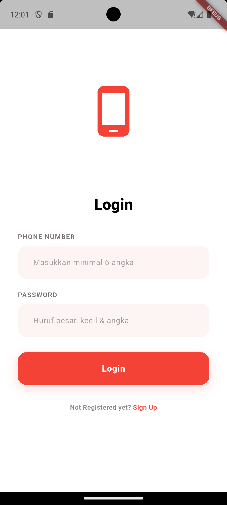
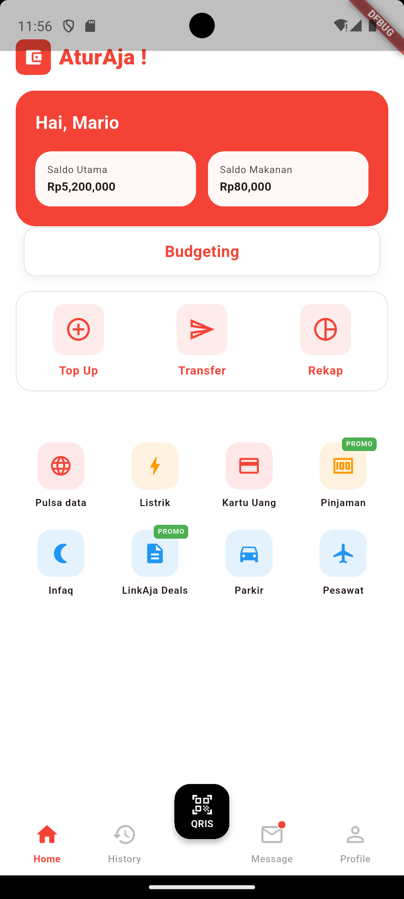
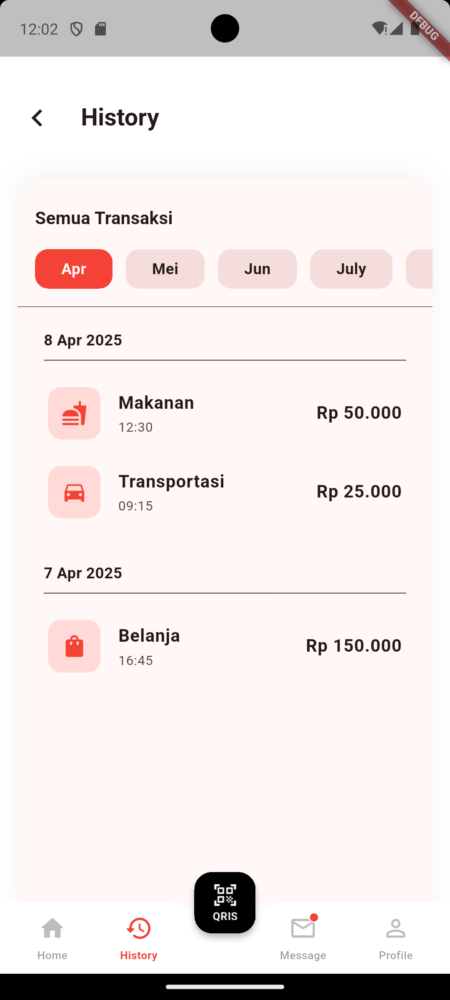

ProjectAturAja
Kelompok 2 Pemrograman Mobile
Anggota :

1. Dishwar Raya Pradipta 24082010008
2. Azarya Yanuar Krisyanto 24082010012
3. Icha Leona Ardianti 24082010015
4. Fachrisya Maula Ardhi 24082010023
5. Athalia Jevon Priyadi 24082010026

Deskripsi Aplikasi :
AturAja merupakan aplikasi dompet digital yang berfokus pada fitur budgeting digital yang terintegrasi dengan E-Wallet lainnya untuk membantu pengguna dalam mengelola keuangannya secara bijak. Dengan aplikasi ini, pengguna tidak hanya menggunakan dompet digital untuk bertransaksi, tetapi juga menjadikannya sistem pembelajaran, merencanakan dan mengatur keuangan pribadi secara berkelanjutan.

Model Bisnis Monetisasi:
AturAja menggunakan Model Bisnis Monetisasi berupa biaya transaksi dan layanan, dengan adanya integrasi dengan E-Wallet, AturAja mengambil margin kecil dari transaksi yang dilakukan didalam aplikasi

Screenshot Layar Utama Aplikasi :

1.Splashscreen

2.Login

3.Homepage

4.History Page

5.Detail History Page

