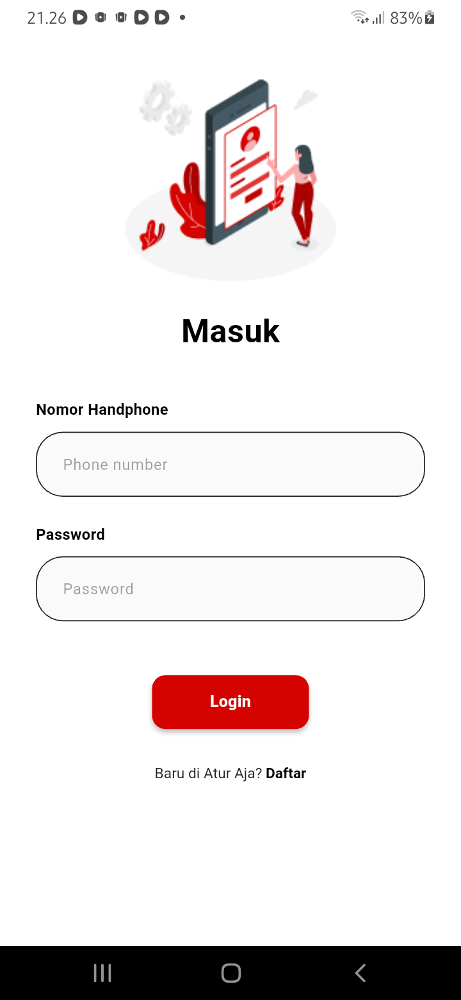
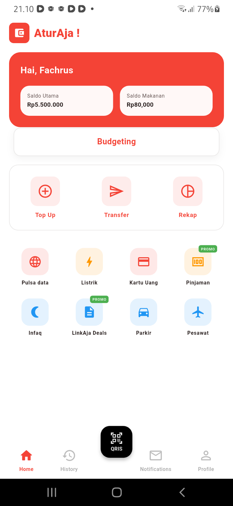
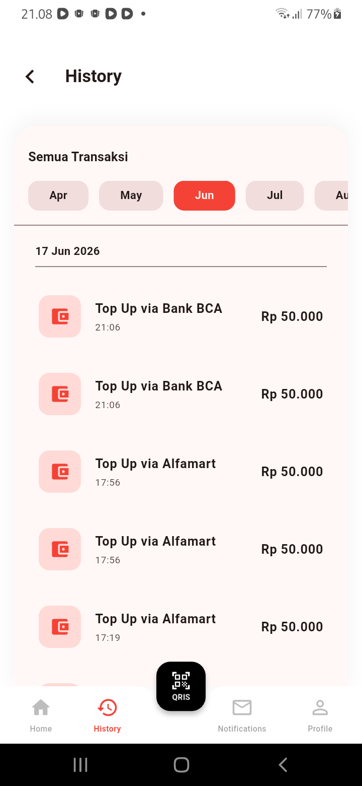
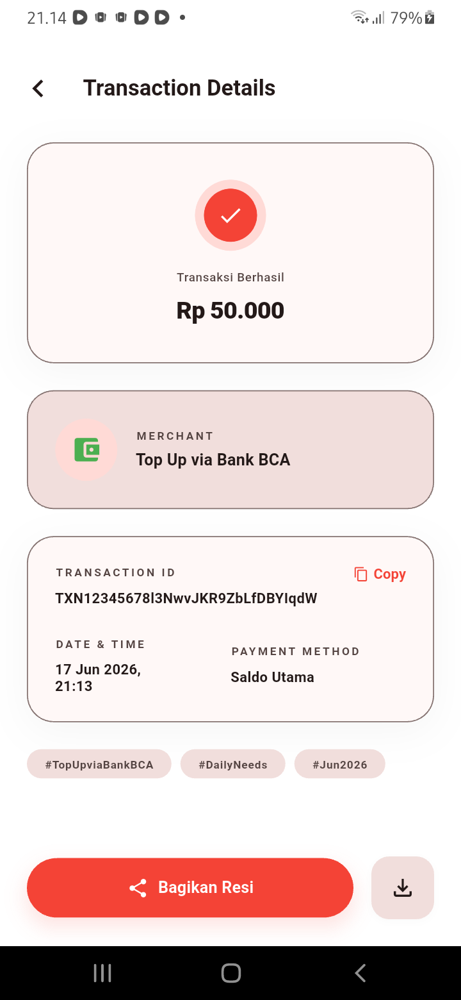
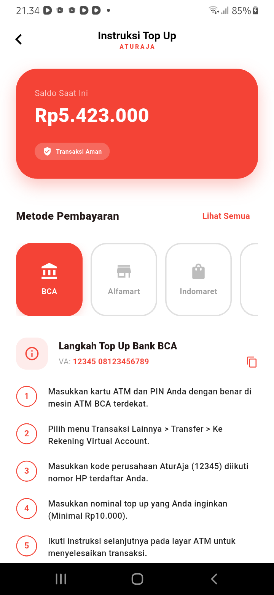
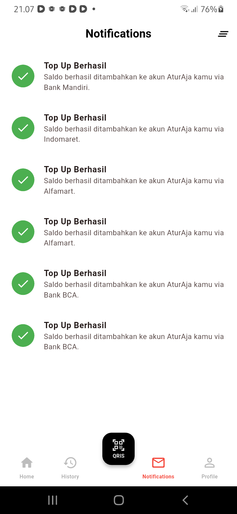
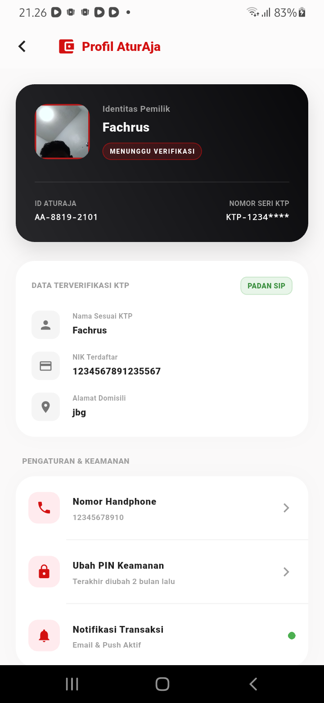
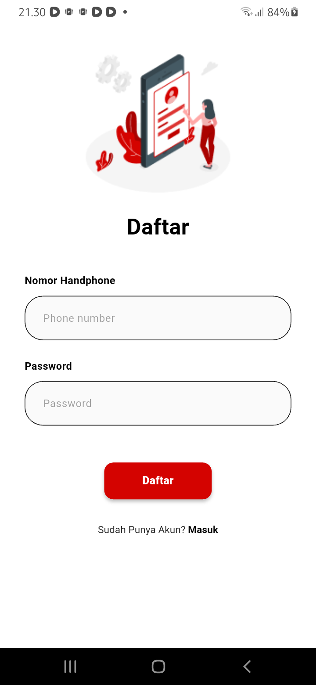

ProjectAturAja
Kelompok 2 Pemrograman Mobile

Anggota :

1. Dishwar Raya Pradipta 24082010008
2. Azarya Yanuar Krisyanto 24082010012
3. Icha Leona Ardianti 24082010015
4. Fachrisya Maula Ardhi 24082010023
5. Athalia Jevon Priyadi 24082010026

Tema Aplikasi: FinTech

Deskripsi Aplikasi :
AturAja merupakan aplikasi dompet digital yang berfokus pada fitur budgeting digital yang terintegrasi dengan E-Wallet lainnya untuk membantu pengguna dalam mengelola keuangannya secara bijak. Dengan aplikasi ini, pengguna tidak hanya menggunakan dompet digital untuk bertransaksi, tetapi juga menjadikannya sistem pembelajaran, merencanakan dan mengatur keuangan pribadi secara berkelanjutan.

Model Bisnis Monetisasi:
AturAja menggunakan Model Bisnis Monetisasi berupa biaya transaksi dan layanan, dengan adanya integrasi dengan E-Wallet, AturAja mengambil margin kecil dari transaksi yang dilakukan didalam aplikasi

Jenis Firebase yang digunakan: Cloud Firestore

Struktur koleksi atau node Firebase: json
Collection : 
-budget : id, title, usedBudget, totalBudget, category
-history : id, description, amount, createdAt, type
-users : phone, password, fullName, email, nik, alamat, ktpImageUrl, selfieImageUrl, createdAt, updatedAt, kycStatus, isEmailVerified, isPhoneVerified
-top-up history : description, amount, type, created_at

Jumlah data yang digunakan sebanyak 89 data (document) dengan collection sebagai berikut : 
-budget
-history
-users
-topup_history

Fitur utama aplikasi:
1.Top Up
2.Create New Budgeting
3.History Top Up
4.Notifikasi
5.Profile

Screenshot Layar Utama Aplikasi :

1.Splashscreen

2.Login

3.Homepage

4.History Page

5.Detail History Page

6.TopUp

7.Notifikasi

8.Profile

9.SignUp

Cara menjalankan aplikasi:
1.Membuat akun(apabila belum memiliki akun)
2.Masuk login dengan Nomor HP dan Password
3.Klik Top Up pada HomePage
4.Menambah saldo atau top up dengan klik clipboard, maka saldo akan bertambah dan akan muncul pada menu notifikasi
5.Melihat History Top Up pada menu history
6.Klik Budgeting
7.Membuat budgeting baru dengan mengisi nama, nominal dan jenis budgeting
8.Klik Profile untuk melihat data diri dan Log Out